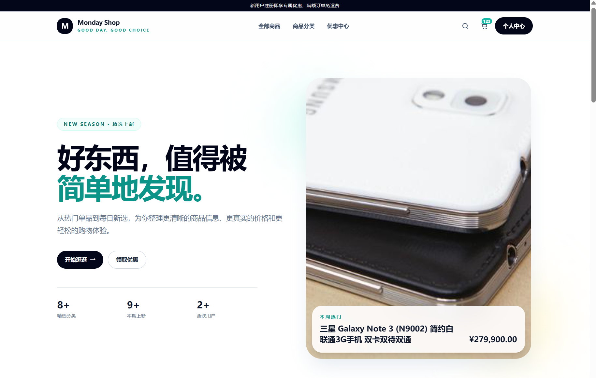
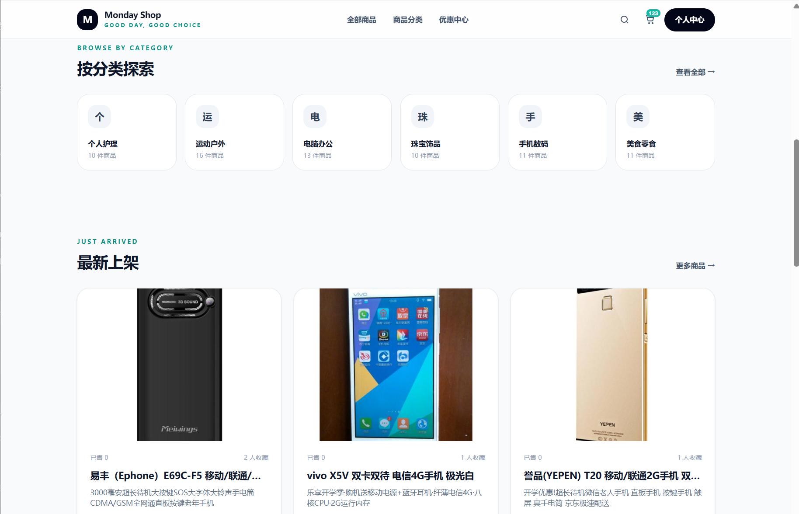
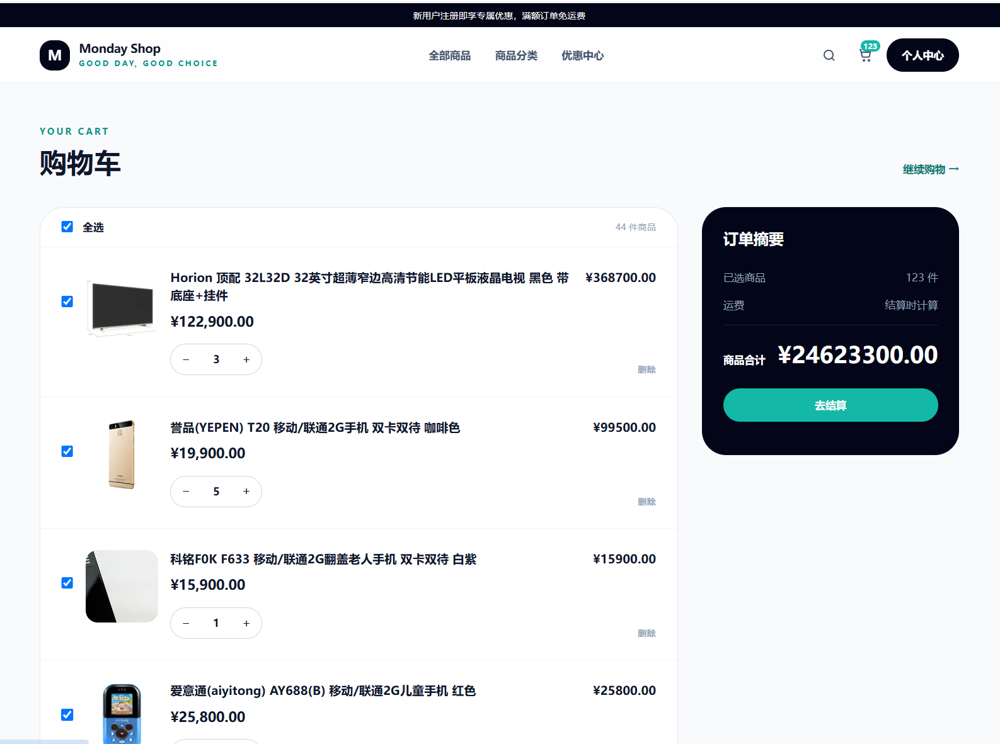
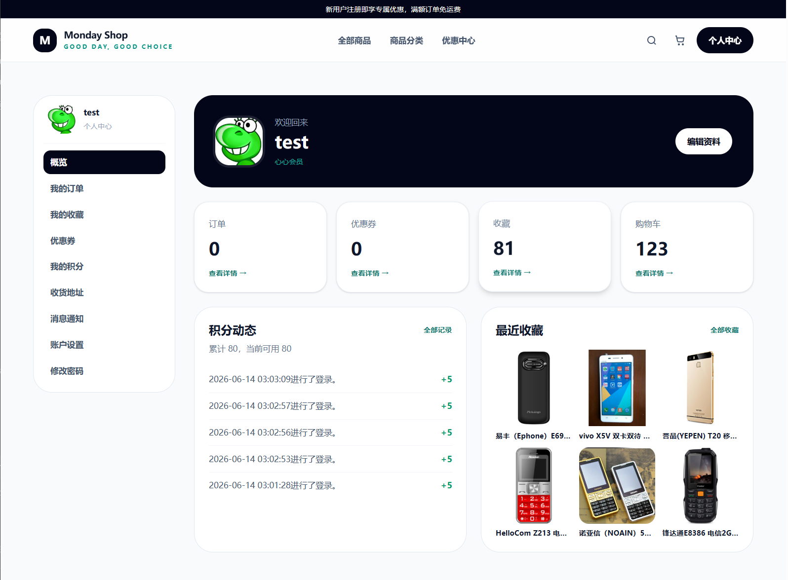
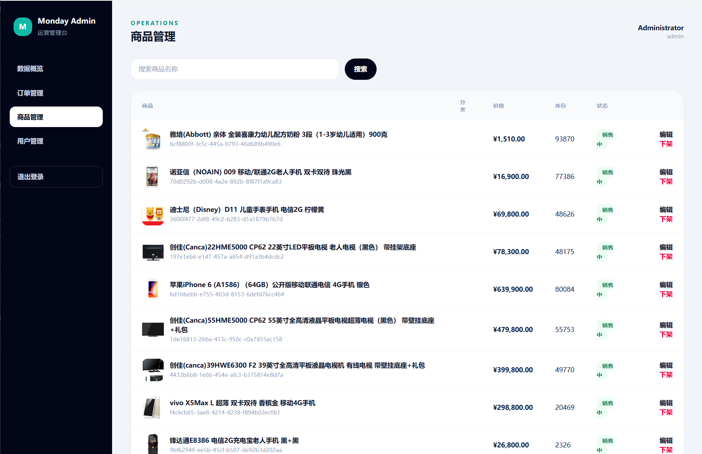

# Monday Shop

一个基于 Laravel 构建的现代化电商平台，提供完整的购物体验和后台管理功能。

## 功能特性

### 前台功能
- 用户注册与登录（支持第三方 OAuth）
- 商品浏览与搜索
- 商品分类展示
- 购物车管理
- 订单管理
- 用户收藏
- 积分系统

### 后台管理
- 商品管理（上架/下架/编辑）
- 订单管理（发货处理）
- 用户管理
- 数据概览

## 技术栈

- **框架**: Laravel 13.x
- **数据库**: SQLite
- **缓存**: File Cache
- **前端**: Blade Template + Tailwind CSS

## 页面预览

### 首页


### 商品分类


### 购物车


### 用户中心


### 后台管理


## 快速开始

### 环境要求
- PHP 8.3+
- Composer

### 安装步骤

```bash
# 安装依赖
composer install

# 复制环境配置
cp .env.example .env

# 生成应用密钥
php artisan key:generate

# 运行数据库迁移
php artisan migrate

# 创建存储链接
php artisan storage:link

# 启动开发服务器
php artisan serve --port=8080
```

### 登录账号

**后台管理员:**
- 用户名: `admin`
- 密码: `admin`

**前台测试用户:**
- 用户名: `test`
- 密码: `test123`

## 项目结构

```
.
├── app/
│   ├── Controllers/     # 控制器
│   ├── Models/          # 模型
│   ├── Services/        # 服务层
│   └── ...
├── resources/
│   ├── views/           # 视图模板
│   └── ...
├── routes/              # 路由配置
├── database/            # 数据库迁移和数据
├── docs/
│   └── screenshots/     # 项目截图
└── public/              # 静态资源
```

## 许可证

MIT License