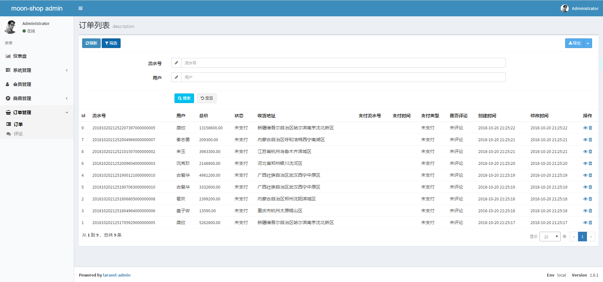
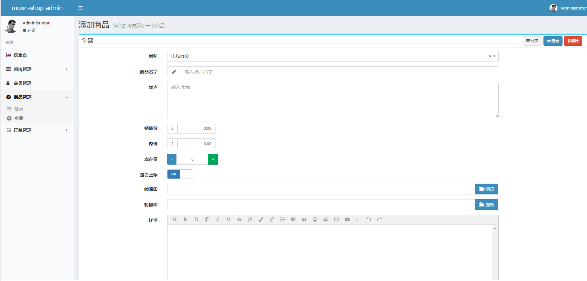

# WaitMoonMan/monday-shop
****
* 首页图

****
* 后台订单列表

****
* 后台商品列表

****
* 后台添加商品

## Feture
- [x] **响应式网站**
- [x] **第三方登录**
    * `Github`
    * `QQ`
    * 微博 
- [x] **第三方支付**
    - [x] `pays-api` 内置支持支付宝微信
    - [ ] 支付宝支付
    - [ ] 微信支付
- [x] **购物车**使用`H5`本地存储 + 数据库持久化存储
- [x] **商品搜索**支持拼音首字母 + `AJAX`无刷新显示
- [x] **订阅模块**每周定时推送一封邮件包含最受欢迎，最新，最火卖商品
- [x] **分类排序**后台使用拖动排序，得到优先展示的分类
- [ ] **评论模块**
## Installation
1. 获取源代码
* 直接下载压缩包或者[monday-shop.zip下载](https://github.com/WaitMoonMan/monday-shop/archive/master.zip)
* 或者`git`克隆源代码
```shell
git clone git@github.com:WaitMoonMan/monday-shop.git
```
2. 安装依赖扩展包
```shell
composer install
```
3. 生成配置文件(修改其中的配置选项:数据库的一定要修改)
```shell
cp .env.example .env
```
4. 使用安装命令(会执行执行数据库迁移，填充，监听队列 !!! 不需要再监听队列，此命令已包含)
```shell
php artisan moon:install
```
## Usage
* 任务调度(打算每周六早八点发送订阅邮件/ !!! 为方便展示，项目现为一个小时发送一次订阅)
    * [windows下使用laravel任务调度](http://blog.csdn.net/forlightway/article/details/77943539)先把
    * [linux请去看官网](https://d.laravel-china.org/docs/5.5/scheduling)
### Commands
| 命令  | 一句话描述 |
| ----- | --- |
|`php artisan moon:install`|安装应用程序|
|`php artisan moon:uninstall`|卸载网站(清空数据库，缓存，路由)|
|`php artisan moon:cache`|执行缓存（缓存配置，路由，类映射）|
|`php artisan moon:clear`|清除缓存|
|`php artisan moon:copy`|复制项目内置的静态资源|
|`php artisan moon:delete`|删除项目及上传的基本静态资源|
|`php artisan queue:work --tries=3`|监听队列(邮件发送，图片裁剪 !!!|
## Packages
| 扩展包 | 一句话描述 | 在本项目中的使用案例 |  
| --- | --- | --- |   
|[z-song/laravel-admin](https://github.com/z-song/laravel-admin)|后台|快速搭建后台系统|
|[mews/captcha](https://github.com/mewebstudio/captcha)|验证码|登录注册功能使用验证码验证|
|[overtrue/laravel-socialite](https://github.com/overtrue/laravel-socialite)|第三方登录|用户登录可以使用Github,QQ,新浪微博|
|[intervention/image](https://github.com/Intervention/image)|图片处理|是为 Laravel 定制的图片处理工具，加水印|  
|[webpatser/laravel-uuid](https://github.com/webpatser/laravel-uuid)|uuid生成|商品添加增加一个uuid，订单号|  
|[renatomarinho/laravel-page-speed](https://github.com/renatomarinho/laravel-page-speed)|压缩页面DOM|打包优化您的网站自动导致35％以上的优化|  
|[overtrue/laravel-pinyin](https://github.com/overtrue/laravel-pinyin)|汉语拼音翻译|分类首字母查询|  
## Reference
* [Laravel 的中大型專案架構](http://oomusou.io/laravel/laravel-architecture/)
* [十个 Laravel 5 程序优化技巧](https://laravel-china.org/articles/2020/ten-laravel-5-program-optimization-techniques)
## Errors
* 监听队列如果长时间没反应，或者一直重复任务
    * 数据库没配置好，导致队列任务表连接不上
    * 邮件配置出错，导致发送邮件一直失败    
* `SQLSTATE[HY000]: General error: 1215 Cannot add foreign key constraint`
    * 数据库引擎切换到`InnoDB`
## License
MIT
