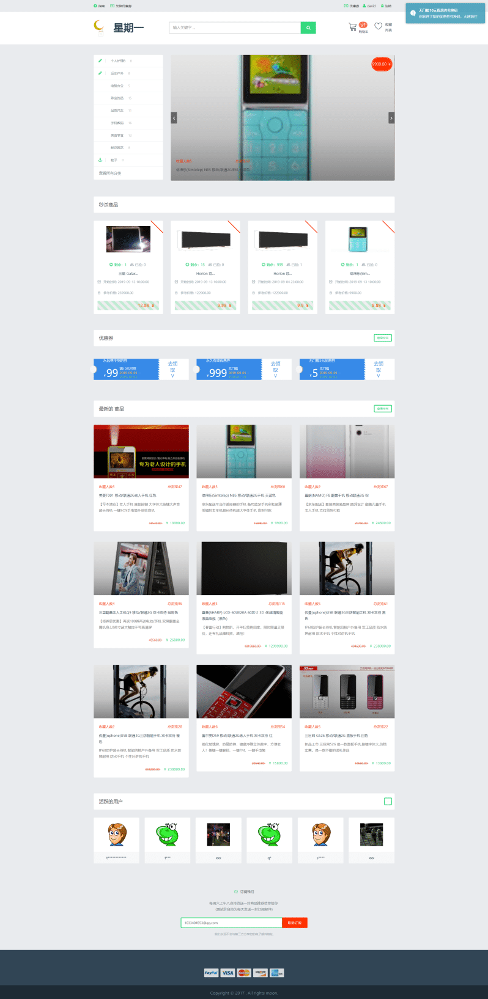
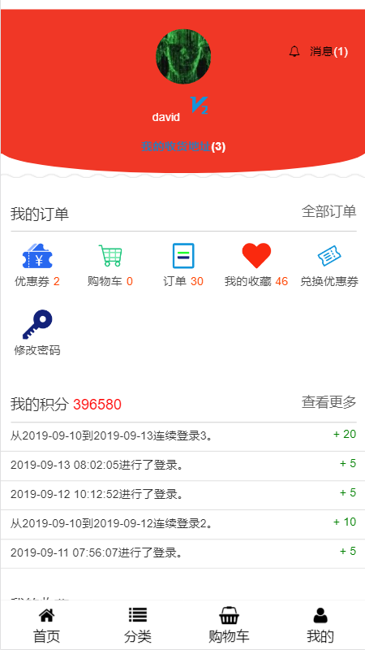
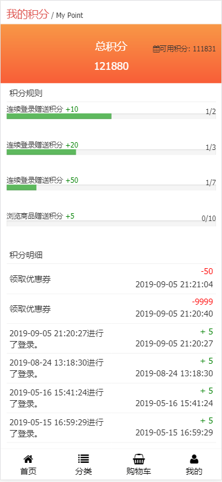

# DavidNineRoc/monday-shop
## TODO
* 再来一单
* 查看物流
* 数据分析
* API 接口开发,具体看文目录 API
## 目录说明
* [演示地址](#演示地址)
* [页面展示](#页面展示)
* [特色](#Feature)
* [安装](#Installation)
* [命令行功能](#Commands)
* [秒杀处理逻辑](#秒杀处理逻辑)
* [API文档(新)](#API)
* [依赖的 Packages](#Packages)
* [文章引用](#Reference)
* [错误/注意点](#Notice)
* [协议](#License)

## 演示地址
[演示地址：http://shop.shiguopeng.cn](http://shop.shiguopeng.cn)

[后台地址：http://shop.shiguopeng.cn/admin](http://shop.shiguopeng.cn/admin)
* 账号：`admin`
* 密码：`admin`
****
* 测试支付功能
    * 下载[支付宝沙箱](https://sandbox.alipaydev.com/user/downloadApp.htm)
    * 账号：`eyxweq5099@sandbox.com`
    * 密码：`111111`
    * 支付密码：`111111`
    * 当前账户余额：`9999999.99`
    * 余额不足，请联系我及时充值

## 页面展示







## Feature
- [x] **库存问题**
    * [x] 普通订单使用乐观锁防止超卖
    * [X] 秒杀订单使用`Redis`队列防止超卖
- [x] **首页数据全走缓存（推荐使用`Redis`驱动）**
    * [x] 未登录的首页，零数据库查询，通过缓存驱动
    * [x] 计划任务每分钟会更新一次首页数据
    * [x] 开启秒杀模块，零数据库查询，通过`Redis`驱动
    * [ ] 登录之后首页零数据库查询，`Session`驱动数据
- [x] **积分功能**
    * [x] 每日首次登录(访问网站)得到积分
    * [x] 连续登录 n 天得到积分
    * [x] 当天浏览商品数量 n 个得到积分
    * [x] 后台可新增 n+ 积分种类
    * [x] 完成订单可获得金钱等比例积分
- [x] **优惠券功能**
    * [x] 满减优惠
    * [x] 积分兑换满减优惠券
    * [x] 发放兑换码，兑换优惠券
- [x] **物流功能**
    * [x] 运费设置
    * [x] 快递物流
- [x] **秒杀功能**
    * 秒杀过期，自动回退库存
    * 使用延时队列，当订单超过三十分钟(可配置)未付款，自动取消订单
    * 秒杀商品，如果用户收藏，发送邮件提醒活动
    * 后台秒杀模块的开启关闭
    * 秒杀的商品数量，皆通过`Redis`读取
- [x] **第三方授权登录 + 登录回跳**
    * `Github`
    * `QQ`
    * 微博 
- [x] **第三方支付(支持自动适应手机，web 支付)**
    - [x] 支付宝支付,退款
    - [ ] 微信支付
- [x] **购物车**
    * 使用`H5`本地存储
    * 登录之后同时显示本地购物车和数据库购物车数量
    * 用户登录之后会询问是否需要持久化到数据库
- [x] **商品搜索**
    * 使用**ElasticSearch**全文索引
    * 支持拼音首字母
    * `AJAX`无刷新显示
- [x] **订阅模块**
    * 每周定时推送一封邮件包含最受欢迎，最新，最火卖商品
- [x] **分类排序**
    * 后台使用拖动排序，可以设置在商城首页优先展示的分类
- [x] **订单模块**
    * 订单下单
        * 买家支付
        * 后台发货 / 卖家申请退款
        * 买确认收货 / 后台确认收货
        * 买家确认订单获取积分
    * 用户下订单之后可以评论
- [x] **站内消息**
    * 消息通知
    * 多模板类型通知, 兑换码通知、文章通知等等
    * 轮询通知消息，一点即达
- [x] **数据统计**
    * 每天晚上一点进行站点数据统计
- [ ] 全文搜索
- [x] **响应式网站**

## Installation
1. 获取源代码
* 直接下载压缩包或者[monday-shop.zip下载](https://github.com/DavidNineRoc/monday-shop/archive/master.zip)
* 或者`git`克隆源代码
```shell
git clone git@github.com:DavidNineRoc/monday-shop.git
```
2. 安装依赖扩展包
```shell
composer install
```
3. 生成配置文件(修改其中的配置选项:数据库的一定要修改)
```shell
cp .env.example .env
```
4. 开启秒杀功能
    * 安装前可以把`database/seeds/SettingsTablesSeeder.php`中的秒杀开启设置为`1`
    * 安装之后可以直接通过后台管理系统设置中的配置设置管理
5. 使用安装命令(会执行执行数据库迁移，填充，等)
```shell
php artisan moon:install
```
* 任务调度(订阅推荐，数据统计！！！)
    * windows
        * [windows下使用laravel任务调度](http://blog.csdn.net/forlightway/article/details/77943539)
    * Linux
        * `* * * * * php /你的项目根目录/artisan schedule:run >> /dev/null 2>&1`
        * [linux 详情请去看官网](https://laravel.com/docs/5.5/scheduling)
* 运行队列处理器(发送订阅邮件，自动取消订单)
    * `Linux`系统: 
        * `nohup php artisan queue:work --tries=3 &`
    * `windows`系统直接打开一个命令行窗口，运行命令，不要关闭窗口即可
        * `php artisan queue:work --tries=3`

## Commands
| 命令  | 一句话描述 |
| ----- | --- |
|`php artisan moon:install`|安装应用程序|
|`php artisan add:shop-to-search`|生成全文索引|
|`php artisan moon:uninstall`|卸载网站(清空数据库，缓存，路由)|
|`php artisan moon:cache`|执行缓存（缓存配置，路由，类映射）|
|`php artisan moon:clear`|清除缓存|
|`php artisan moon:copy`|复制项目内置的静态资源|
|`php artisan moon:delete`|删除项目及上传的基本静态资源|
|`php artisan moon:export`|导出用户数据到json文件|
|`php artisan moon:count-site`|统计站点任务（每天夜里一点执行）|
|`php artisan moon:del-seckills`|删除秒杀数据 (每小时自动执行一次)|
|`php artisan moon:moon:del-score-data`|删除积分缓存数据 (每天夜里 0 点执行)|
|`php artisan moon:update-home`|更新首页数据 (每分钟自动执行一次)|
|`php artisan moon:send-subscribes`|发送订阅邮件 (每个礼拜六早上八点)|
|`php artisan queue:work --tries=3`|监听队列(邮件发送，处理过期的秒杀数据 !!!|

## 秒杀处理逻辑
```php

## 初始化抢购数据
<?php

// 假设当前秒杀活动的 id 为 9
// 可以在模型的 created 事件做这个事情
$id = 9;

// 填充一个 redis 队列，数量为抢购的数量，后面的 9 无意义
\Redis::lpush("seckills:{$id}:queue", array_fill(0, $seckill->number, 9));

?>

## 抢购
<?php

// 从路由或者参数中得到当前秒杀活动的 id
$id = 9;
$userId = auth()->id();

// 判断是否已经开始了秒杀

// 返回 0，代表当前用户已经抢购过了
if (0 == Redis::hset("seckills:{$id}:users:{$userId}", 'id', $userId)) {

    return responseJson(403, '你已经抢购过了');
}

// 如果从队列中读取到了 null，代表已经没有库存
if (is_null(Redis::lpop("seckills:{$id}:queue"))) {

    return responseJson(403, '已经抢购完了');
}

// 这里就可以开始入库订单

?>

## 利用 crontab 定时扫描过期数据，回滚库存，删除过期 redis (可选)
<?php

 // 查出已经过期确没有回滚过的秒杀，
Seckill::query()
       ->where('end_at', '<', date('Y-m-d H:i:s'))
       ->get()
       ->map(function (Seckill $seckill) {
           
           // 先模糊查找到所有用户 key
           $ids = Redis::keys("seckills:{$seckill->id}:*");
           Redis::del($ids);
           
           // 回滚库存
           // 做更多的事
       };
       
?>

```

## API
* 接口响应数据说明
    * 响应的数据格式总是保证拥有基本元素(`code`, `msg`, `data`)
    * `code` 请参考接口全局状态码说明
    * `msg`  此次请求消息,如果返回状态码为非成功,可直接展示`msg`
    * `data` 如果为列表页将会一个数组类型(如商品列表),否则为一个对象类型(商品详情)
    * 如有额外扩展字段, 将于基本元素平级, 如分页的`count`
```json
{
	"code": 401,
	"msg": "无效的token",
	"data": []
}
```
* 刷新`token`说明
    * 为了保证安全性,`token`的有效时间为`60`分钟
    * 当旧的`token`失效时,服务器会主动刷新,并在响应头加入`Authorization`
    * 这时候旧的`token`将会加入黑名单不能再使用, 请将在响应头中新的`token`保存使用
    * 当服务器主动刷新之后,会有一个期限(`2`周).服务器将无法再刷新,将返回`402`状态码,请重新登录账户
* `token`使用流程说明
```javascript
// 全局请求类
function request(_method, _url, _param, _func) {

    $.ajax({
        method: _method,
        url: _url,
        data: _param,
        beforeSend: function (xhr) {
            console.log(xhr);
            xhr.setRequestHeader('Authorization', localStorage.getItem('api_token'))
        },
        complete: function (xhr, a, b) {

            if (xhr.getResponseHeader('Authorization')) {
                localStorage.setItem('api_token', xhr.getResponseHeader('Authorization'))
            }
        },
        success: function (res) {

            // token 永久过期
            if (res.code === 402) {
                // 跳去登录页面
                return false;
            }
            // 更多状态码判断
        }
    });
}

// 第一次登录保存 token, 之后使用全局类请求数据即可

```
    
* 接口全局状态码说明(建议封装一个全局请求类或者中间件,统一处理全局状态码)
    * `200`
        * 请求数据成功
    * `401` 
        * 身份验证出错(未登录就请求数据)
        * 非法无效的`token`
        * `token`已被加入黑名单(一般不会出现这个问题,出现这个问题那么就是你刷新 token 的逻辑有问题)
    * `402`
        * `token`已完全失效,后台暂设为 2 周,再也无法刷新,请重新登录账户
    * `500`
        * 服务器出错,具体请参考响应的消息
* __接口文档__(重要的事情说三遍)

[接口文档](http://shop.shiguopeng.cn/docs.html)

[接口文档](http://shop.shiguopeng.cn/docs.html)

[接口文档](http://shop.shiguopeng.cn/docs.html)


## Packages
| 扩展包 | 一句话描述 | 在本项目中的使用案例 |
| --- | --- | --- |
|[z-song/laravel-admin](https://github.com/z-song/laravel-admin)|后台|快速搭建后台系统|
|[mews/captcha](https://github.com/mewebstudio/captcha)|验证码|登录注册功能使用验证码验证|
|[overtrue/laravel-socialite](https://github.com/overtrue/laravel-socialite)|第三方登录|用户登录可以使用Github,QQ,新浪微博|
|[intervention/image](https://github.com/Intervention/image)|图片处理|是为 Laravel 定制的图片处理工具，加水印|
|[webpatser/laravel-uuid](https://github.com/webpatser/laravel-uuid)|uuid生成|商品添加增加一个uuid，订单号|
|[renatomarinho/laravel-page-speed](https://github.com/renatomarinho/laravel-page-speed)|压缩页面DOM|打包优化您的网站自动导致35％以上的优化（已移除使用）|
|[overtrue/laravel-pinyin](https://github.com/overtrue/laravel-pinyin)|汉语拼音翻译|分类首字母查询|
|[acelaya/doctrine-enum-type](https://github.com/acelaya/doctrine-enum-type)|枚举|优化代码中的映射|

## Reference
* [Laravel 的中大型專案架構](http://oomusou.io/laravel/laravel-architecture/)
* [十个 Laravel 5 程序优化技巧](https://laravel-china.org/articles/2020/ten-laravel-5-program-optimization-techniques)
* [十个 Laravel 5 程序优化技巧](http://www.ruanyifeng.com/blog/2018/10/restful-api-best-practices.html)
* [服务器做了两个优化 CPU 使用率减低 40%(使用缓存优化访问量不写数据库)](https://learnku.com/articles/13366/the-server-has-made-two-optimization-and-the-cpu-utilization-rate-has-been-reduced-by-40)

## Notice
* 建议开启`bcmath`扩展保证字符串数字运算正确
* 监听队列如果长时间没反应，或者一直重复任务
    * 数据库没配置好，导致队列任务表连接不上
    * 邮件配置出错，导致发送邮件一直失败
* `composer install`安装不上依赖
    * 请删除`composer.lock`文件，重新运行`composer install`
* `SQLSTATE[HY000]: General error: 1215 Cannot add foreign key constraint`
    * 数据库引擎切换到`InnoDB`
* `composer install` 安装依赖错误
    * `composer.lock`锁定了镜像源,删除`composer.lock`再执行即可
## License
The MIT License (MIT)
